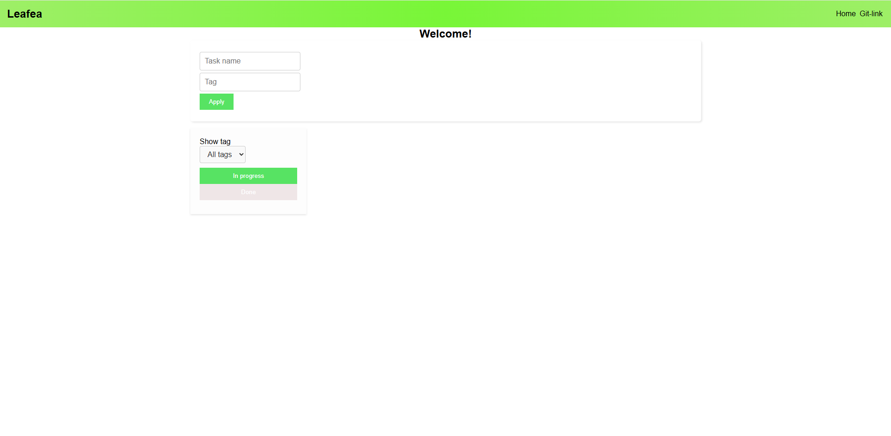

# To-do list in React

UA: Це простий To-do лист, у якого є теги та фільтрація по тегам. Також завдання можна видалити або помітити як виконаним.
Стилізація зроблена за допомогою module.css

# Скріншоти роботи
Скріншот інтерфейсу

Приклад доданного завдання

Приклад фільтрації по тегам

Видалення та помітка як "Виконане"

